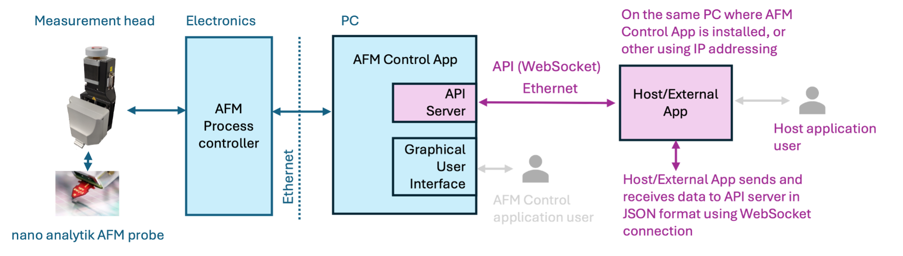

# AFM Control API Documentation

Welcome to the **AFM Control by nano analytik GmbH API repository**! This repository provides comprehensive documentation and example source code to help you integrate with our AFM system using our API.

## Overview

The API enables users to control the AFM control application remotely. This is especially useful for those who need to operate the AFM from their own host application, allowing for seamless integration with other equipment and centralized control from the host system. 

Functionally, the system reacts the same way whether an operation is performed manually by a user or executed through an API command. This ensures consistent behavior and outcomes, regardless of the method used to interact with the AFM control application. 

The API uses JSON (JavaScript Object Notation) commands that are sent between the AFM control app server and a client over the **WebSocket protocol**. Each API object allows specific operations, such as setting or getting values. The following sections detail the available API commands, including examples of JSON requests and the expected responses. 

## Key Features

- **Real-time data access**: Obtain high-precision measurement data from the AFM in real time.
- **Instrument control**: Perform actions such as starting and stopping scans, controlling probe positioning, and adjusting scan parameters.
- **Extensibility**: The API is designed to be flexible, allowing integration with custom applications or software systems used in atomic-scale research.

## Getting Started

### Requirements

Before using the API, ensure you have the following:

- nano analytik AFM system compatible with the API.
- AFM Control application versioned at least 2.0.0
- Authentication credentials (API key) provided by nano analytik GmbH.
- An Ethernet/Internet connection to access the AFM system over the network.

### API Documentation

The complete API documentation is available [docs/README.md](./docs/README.md). It includes detailed information about all available endpoints, request/response formats, and example usage.

### Example Code

We have provided example code in various programming languages to demonstrate how to interact with the API. You can find these examples in the `examples/` directory.

Examples include languages:

- Python
- .NET/C#

Check the [examples/README.md](./examples/README.md) for more details on how to run each example.

## Support

If you have questions or need assistance with the API, please:

- Open an issue in the [Issues](https://github.com/nanoanalytik/nano_analytik/issues) section of this repository.
- Contact our support team at [support@nanoanalytik.net](mailto:support@nanoanalytik.net).
