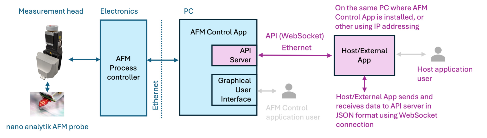
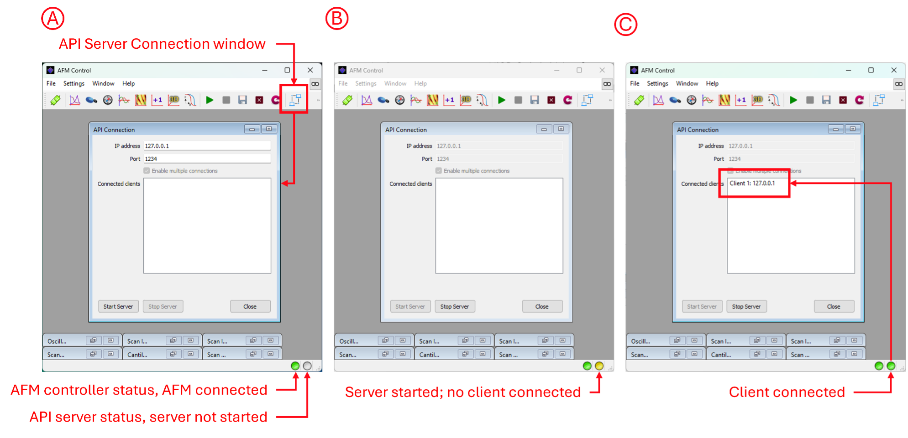

# Atomic Force Microscopy (AFM) API Documentation

Welcome to the documentation of **AFM Control API**! It will help you integrate your software with our AFM system.

## API versions 

Otherwise stated, higher versions of AFM Control API are backward compatible.

### v1.1

**API version 1.1** used in 

 - AFM Control version 2.0.2

### v1.0

**API version 1.0** used in 

 - AFM Control version 2.0.0
 - AFM Control version 2.0.1

## Details 

### Introduction

The API enables users to control the AFM control application remotely. This is especially useful for those who need to operate the AFM from their own host application, allowing for seamless integration with other equipment and centralized control from the host system. 

Functionally, the system reacts the same way whether an operation is performed manually by a user or executed through an API command. This ensures consistent behavior and outcomes, regardless of the method used to interact with the AFM control application. 

The API uses JSON (JavaScript Object Notation) commands that are sent between the AFM control app server and a client over the [**WebSocket protocol**](https://en.wikipedia.org/wiki/WebSocket). Each API object allows specific operations, such as setting or getting values. The following sections detail the available API commands, including examples of JSON requests and the expected responses. 

To control the system via the API server using WebSocket, client applications need to establish a WebSocket connection by sending a handshake request to the server. Once connected, clients can send control commands in the form of structured JSON messages, specifying desired actions such as data requests or hardware control instructions. The system will respond with real-time feedback, and clients can subscribe to specific data channels, like status updates or measurement results. Each client can individually manage subscriptions, choosing whether to receive data streams or single updates, allowing for efficient control and data monitoring. 

### API WebSocket Server 

To use the API, the user must first start the server. This can be done either automatically by configuring the INI file or manually via the "API Connection" option in the toolbar. Begin by entering the IP address of the PC where the AFM control application is installed, followed by the port number the API server will listen on. Press the "Start Server" button to initiate the server, or press "Stop Server" to halt it. When the server is stopped, all connected clients will be automatically disconnected. 

For the client-server connection on the same machine, use IP address 127.0.0.1. In case, the server and clients are on separate machines, enter the IP address, which is used for IP communication. If you are unsure what is the IP address of the server computer, open a Windows terminal or command prompt and type ipconfig. Look for the IPv4 address of the machine’s Ethernet/WiFi interface (e.g. 192.168.x.x).  

An indicator (in the lower right GUI corner) displays the status of the API server (see Figure below). When the server is not started, the API server indicator is gray (A). When the server is started but no authenticated clients are connected, the indicator is yellow (B). If at least one client is connected and authenticated, the indicator turns green (C). 

### API WebSocket Client 

Clients wishing to connect to the API server must provide the correct IP address and Port. After establishing a connection, clients must authenticate the session. The first command sent over the API must be the "authenticate" command (see the appropriate chapter for details). If a valid API-Key is not provided or the first command is not the authentication command, the server will disconnect the client. Authenticated clients will be listed in the "Connected clients" text box. 

For localhost `127.0.0.1` and IP port `1234`, the API server address is `ws://127.0.0.1:1234`  

A convenient way to test the API communication is by using tools like Postman or in JavaScript in a Web browser. Postman allows you to simulate API requests and examine the responses without the need for custom client software. By configuring Postman with the appropriate WebSocket settings, IP address, Port, and authentication commands, users can efficiently validate their API setup and troubleshoot any issues in the communication process. If you encounter any issues, make sure your antivirus software, VPN, browser or firewall isn't blocking WebSocket connections.  

## Support

If you have questions or need assistance with the API, please:

- Open an issue in the [Issues](https://github.com/nanoanalytik/nano_analytik/issues) section of this repository.
- Contact our support team at [support@nanoanalytik.net](mailto:support@nanoanalytik.net).
